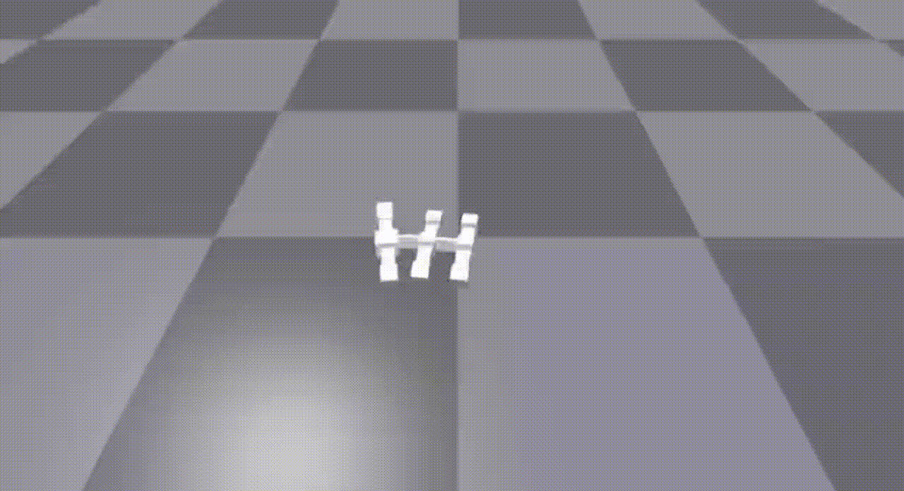

# Robot Locomotion
Collection of learning algorithms for robot locomotion using Revolve2

Instructions to learn locomotion using the Proximal Policy Optimization (PPO) algorithm:

1. Run rl_optimize.py (optional parameters are --visualize to make the simulation visible and
--from_checkpoint to restart the learning task from a previous checkpoint)
2. Run rl_rerun_best.py to rerun the last agent

